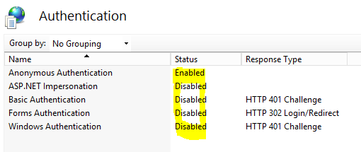

# OpenId Connect Plugin

This sample is an authentication plugin for the Web Client and WebDrawer.

## Versions

This sample has been tested on 9.3.

## Questions

Post any questions regarding this sample in the [SDK support forum](https://community.hpe.com/t5/SDK-API-Support/bd-p/sws-RM_SDKAPI).

## Steps to install

### Build project and Copy files

To build the project:

- copy the files HP.HPTRIM.ServiceAPI.Common.dll, and HP.HPTRIM.ServiceAPI.Model.dll to the lib folder
- build the project
  To install copy these files to the Web Client (or WebDrawer) bin folder:
  _ Microsoft.IdentityModel.Tokens.dll,
  _ Microsoft.IdentityModel.Protocols.OpenIdConnect.dll,
  _ Microsoft.IdentityModel.Protocols.dll,
  _ System.IdentityModel.Tokens.Jwt.dll,
  _ Newtonsoft.Json.dll,
  _ System.Net.Http.Extensions.dll,
  _ System.Net.Http.Primitives.dll,
  _ Microsoft.IdentityModel.Logging.dll, and \* OpenIdConnectPlugin.

### Configure plugin

Edit the file hprmServiceAPI.config and add the folliwng (as a child of the root element):

```
  <pluginAssemblies>
    <add name="OpenIdConnectPlugin"/>
  </pluginAssemblies>
```

### Create the application in your IdP

When you create the application in you IdP ensure that you set the redirect uri to look like this

- for the Web Client https://[MyWebServer]/contentmanager/serviceapi/auth/openid
- for WebDrawer https://[MyWebServer]/WebDrawer/auth/openid
  NOTE: The redirect URI must be all lower case.

### Edit web.config

Below is a sample of the config to enter, you will need to get the well-known uri, secret and client Id from your IdP.

```xml
<add key="oidc.login" value="https://[MyWebServer]/ContentManager/serviceapi/auth/openid" />
<add key="oidc.ClientId" value="[Client Id From Application in IdP]" />
<add key="oidc.ClientSecret" value="[Client Secret From Application in IdP]" />
<add key="oidc.WellKnownUri" value="https://dev-123456.okta.com/oauth2/default/.well-known/oauth-authorization-server" />
```

Additionally you will need to update the assemblyIdentity element to point to to a later version of Newtonsoft, from 6.0 to 10.0, for example:

```xml
      <dependentAssembly>
	    <assemblyIdentity name="Newtonsoft.Json" publicKeyToken="30ad4fe6b2a6aeed" culture="neutral" />
        <bindingRedirect oldVersion="0.0.0.0-10.0.0.0" newVersion="10.0.0.0" />
      </dependentAssembly>
```

### Allow anonymous access in the IIS

IIS will not be handling authentication so we use IIS Manager to allow anonymous access only.

